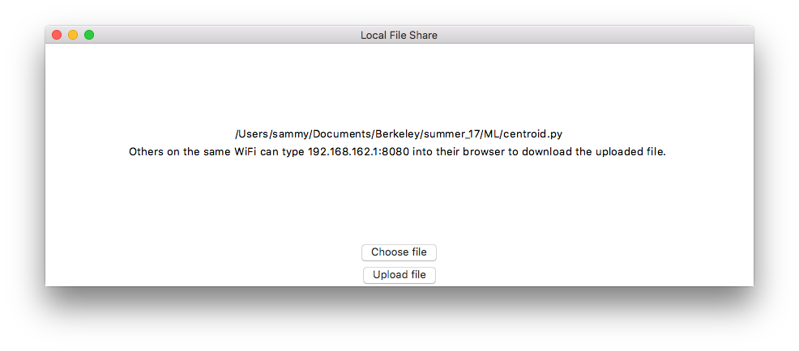
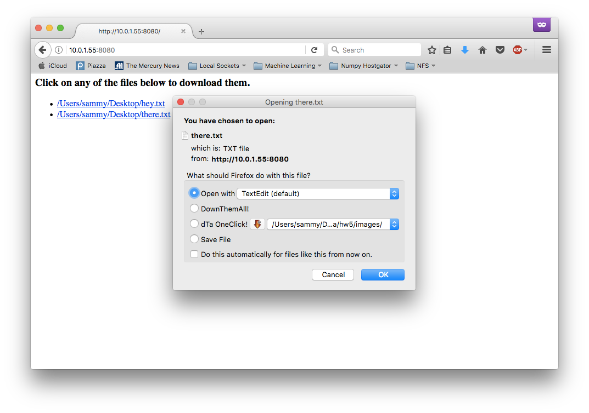

# local_sockets

### P2P File Transfer over local networks.  

* Local Sockets is a silly project codename for sharing files with others over the same WiFi.   

### Mission Statement
* Create a fast, open, secure, and cross-platform solution to share files with others around you.  

### Installation
* On a Windows/Mac/Linux desktop, run 'python app/main.py'

#### Screenshots:

##### Contributors

* Osam Javed <http://osamjaved.com>

##### Next Steps
* To contribute, check out app/Developer.md
